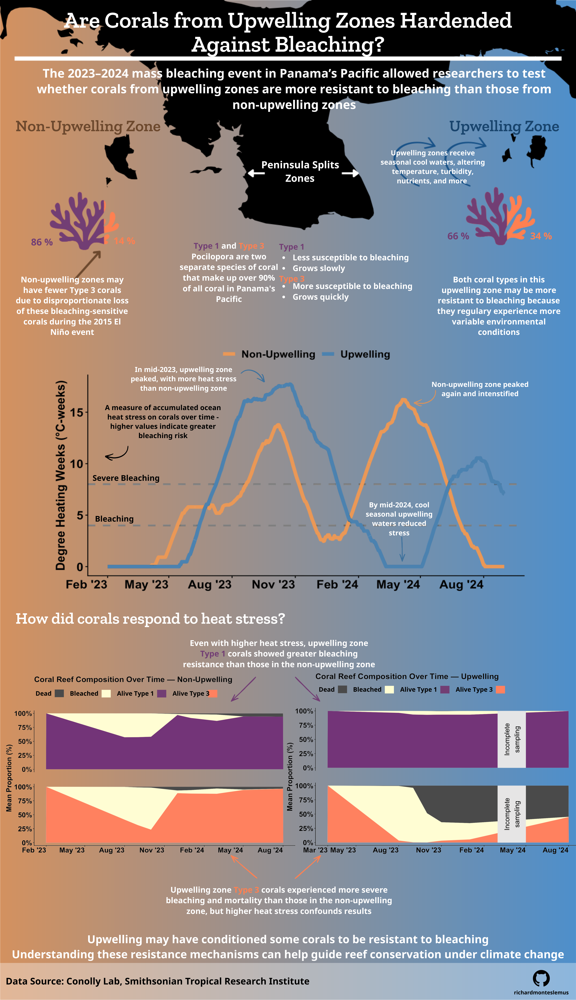
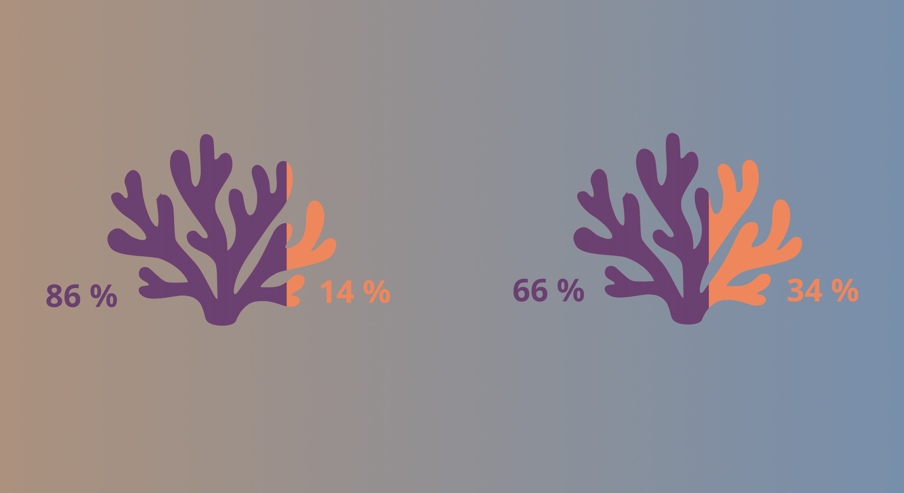
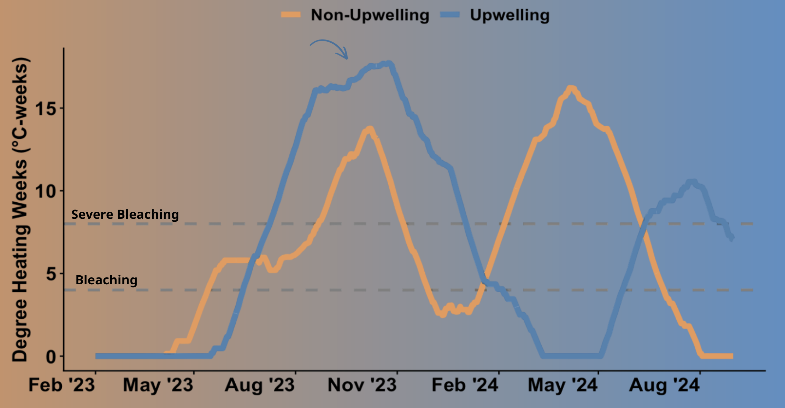
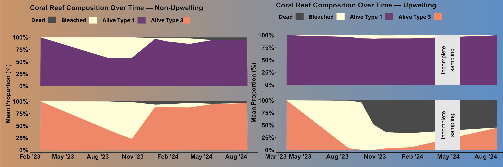

[View Repository on GitHub](https://github.com/richardmonteslemus/eds240-infographic)

##### Background 

Panama’s Pacific coast offers a unique natural experiment because it has two adjacent regions with very different ocean conditions. The Gulf of Panama, which experiences seasonal upwelling, and the Gulf of Chiriquí, which does not. These regions sit side by side, separated by the Azuero Peninsula.

Upwelling is the seasonal movement of deep, cool water to the ocean surface. In Panama, strong winds push warm surface water away from the coast, allowing colder, nutrient-rich water from below to rise and replace it. The Gulf of Panama is relatively flat and open, so winds can easily drive this process. In contrast, the Gulf of Chiriquí is shielded by a mountain range that blocks these winds, preventing upwelling and keeping conditions consistently warm.

As a result, the Gulf of Panama experiences highly variable conditions: fluctuations in temperature, nutrients, turbidity, and pH, while the Gulf of Chiriquí remains relatively stable. Scientists at the Smithsonian Tropical Research Institute have used this contrast to study how corals respond to environmental stress, particularly coral bleaching.

Coral bleaching occurs when prolonged heat stress causes corals to expel the symbiotic algae (called zooxanthellae) that live within their tissues. These algae provide most of the coral’s energy and give them their color. Without them, corals turn white, starve, and are more susceptible to disease and mortality.

This dataset focuses on two dominant coral species in Panama: Pocillopora Type 1 and Type 3. Type 1 is a slow growing, less complex coral that tends to be more resistant to bleaching. Type 3, in contrast, is fast-growing, more branched, and more vulnerable to heat stress. Together, these two types make up roughly 90% of coral cover in Panama's Pacific.

Because upwelling environments are so dynamic, researchers have hypothesized that corals in these areas may be more resistant to bleaching. Frequent exposure to fluctuating conditions may condition these corals and their associated microbial communities to better tolerate stress.

The 2023–2024 mass bleaching event in Panama provides an opportunity to test this idea under real-world conditions. By comparing bleaching and mortality across upwelling and non-upwelling zones, and between coral types, this infographic explores whether corals in more variable environments are actually more resilient to ocean warming.

Understanding these patterns is important. If certain environments or coral types experience greater resistance, they could help inform future conservation and reef restoration strategies in the face of climate change. 


This infographic explores the following questions:

* Differences in coral species composition between upwelling and non-upwelling zones

* How heat stress varies over time across upwelling regimes.

* How bleaching and mortality between Pocillopora Type 1 and Type 3 vary across time in non-upwelling vs upwelling regimes.

{width="80%" fig-align="center" fig-alt="An infographic titled Are Corals from Upwelling Zones Hardended Against Bleaching? There is a map of Panama's coast showing the non-upwelling region in orange and the upwelling region in blue. For plots, there are two coral images in each upwelling regime filled in based on coral species proportion, a line graph showing degree heating weeks differences between regimes, and a stacked area chart showing coral bleaching, recovery, and death differences between regimes"}


##### Approach and Design Choice
**Color Gradient and Map**

The decision to build the infographic around a map of Panama’s Pacific coast colored by upwelling regime was inspired by a satellite image I came across showing sea surface temperature during the upwelling season. In that image, the upwelling region appeared blue, representing cooler waters, while the non-upwelling region appeared red, representing warmer waters. I did something similar with this infographic by coloring the non-upwelling zone which tends to be warm year-round as orange and the upwelling zone which has a cool season as blue. These colors are each associated with the respective temperature. 

Using color and space to the divide the infographic serves a structural purpose. It makes it clear which visualizations correspond to which upwelling regime. Also, it anchors the reader in the actual geography of the study area.

**Coral Image Filled in by Type Percentage**

:::{style="text-align: center;"}
{width="80%"}
:::

Rather than a standard stacked bar chart, I filled in coral silhouettes proportionally to represent species proportion by zone. Since the exact fill doesn't need to be scientifically precise percentage labels are displayed on either side. This graph form visualizes species proportion in an aesthetically pleasing way. 


**Line Graph**

:::{style="text-align: center;"}
{width="80%"}
:::

I used a dual-line graph to plot degree heating weeks for both zones simultaneously, allowing direct comparison of how thermal stress accumulated and diverged over time. The non-upwelling zone is colored orange and the upwelling zone blue, corresponding to the warm-to-cool color gradient theme running throughout the infographic.

**Stacked Area Chart**

:::{style="text-align: center;"}
{width="100%"}
:::

I chose to use stacked area charts to visualize changing proportions of alive, bleached, and dead coral over time across zones and species. This graph format mirrors a reef transect and shows the flow of change over time. Since values represent proportions averaged from individual transect tile bleaching percentages across coral type and upwelling regime, a 0–100% proportional scale is the most appropriate representation.

**Text**

I placed plot explanations wherever natural white space existed rather than defaulting to a consistent position beneath each chart. Keeping all the text below its respective plot would've made the infographic feel too rigid — non-upwelling content stacked on one side, upwelling on the other. Varying the placement gives the layout more flow and breaks up that strict two-column structure.

**Typography**

I used Zilla Slab for titles, it has an academic feel and is legible. For body text and captions I used Nunito Sans, which is clean and pairs well with Zilla Slab. 


##### Accessibility and DEIJ

This infographic uses color-blind friendly colors (orange vs blue and orange vs purple) and maintains high contrast between colors used for comparisons, making it accessible for viewers with color vision differences. Despite the potential for blue and purple to look similar with certain color vision impairments, this does not compromise the legibility of the infographic and there are sufficient labels to ensure the reader can follow along. 

Additionally, the embedded infographic includes alt text, making the content more accessible to a wider audience.

#### Check out the code! 
Click the arrow below to reveal the code used to make these plots
```{r}
#| code-fold: true
#| code-summary: "See the code"
#| eval: false
# Load packages
library(tidyverse)
library(here)
library(janitor)
library(showtext)
library(glue)
library(ggtext)
library(arrow)
library(dplyr)
library(lubridate)

# Read in Eastern Panama Heating Data 

p_east_lines <- readLines(here("posts", "panama-bleaching", "data","panama_pacific_east.txt")) # Create a vector containing each row

p_east_skip_rows <- which(grepl("YYYY MM DD", p_east_lines)) # Finds rows before date

ts_window <- 84 # Remove first 12 weeks for an accurate DHW rolling value 

# Read the data
panama_east <- read.table(here("posts", "panama-bleaching", "data", "panama_pacific_east.txt"), 
                     skip = p_east_skip_rows + ts_window, # Skip non row information at the top of the dataset and first 12 weeks 
                     header = FALSE,
                     col.names = c("year", "month", "day", "sst_min", "sst_max", # Add column names
                                   "sst_90th_hs", "ssta_90th_hs", "hs_90th", 
                                   "dhw", "baa_7day_max")) %>% 
  mutate(site = "panama_east", upwelling = TRUE)

# Read in Western Panama Heating Data 

p_west_lines <- readLines(here("posts", "panama-bleaching", "data","panama_pacific_west.txt")) # Create a vector containing each row

p_west_skip_rows <- which(grepl("YYYY MM DD", p_west_lines)) # Finds rows before date

# Read the data
panama_west <- read.table(here("posts", "panama-bleaching", "data", "panama_pacific_west.txt"), 
                     skip = p_west_skip_rows + ts_window, # Skip non row information at the top of the dataset and first 12 weeks 
                     header = FALSE,
                     col.names = c("year", "month", "day", "sst_min", "sst_max", # Add column names
                                   "sst_90th_hs", "ssta_90th_hs", "hs_90th", 
                                   "dhw", "baa_7day_max")) %>% 
  mutate(site = "panama_west", upwelling = FALSE)

# Read in bleaching grid data 
bleaching_point_data <- read_parquet(here("posts", "panama-bleaching", "data", "point_data.parquet"))

# Create date and filter to Feb 2023 - Aug 2024
panama_east_filtered <- panama_east %>%
  mutate(date = as.Date(paste(year, month, day, sep = "-"))) %>%
  filter(date >= as.Date("2023-02-01") & date <= as.Date("2024-08-31"))

# Create date and filter to Feb 2023 - Aug 2024
panama_west_filtered <- panama_west %>%
  mutate(date = as.Date(paste(year, month, day, sep = "-"))) %>%
  filter(date >= as.Date("2023-02-01") & date <= as.Date("2024-08-31"))

##################### Plot Degree Heating Overtime ####################
# Combine datasets
panama_combined <- bind_rows(
  panama_east_filtered %>% mutate(site = "Upwelling"),
  panama_west_filtered %>% mutate(site = "Non-Upwelling")
)

ggplot(panama_combined, aes(x = date, y = dhw, color = site)) +
  geom_hline(yintercept = 4, linetype = "dashed", linewidth = 2) +
  geom_hline(yintercept = 8, linetype = "dashed", linewidth = 2) +
  geom_line(linewidth = 2) +
  scale_color_manual(values = c("Upwelling" = "steelblue", "Non-Upwelling" = "darkorange")) +
  scale_x_date(
    breaks = seq(as.Date("2024-08-01"), as.Date("2023-02-01"), by = "-3 months"),
    date_labels = "%b %Y"
  ) +
  labs(
    title = NULL,
    x = NULL,
    y = "Degree Heating Weeks (°C-weeks)",
    color = NULL
  ) +
  theme_classic() +
  theme(
    axis.text.x = element_text(angle = 45, hjust = 1, size = 14, face = "bold"),
    axis.text.y = element_text(size = 14, face = "bold"),
    axis.title.y = element_text(size = 14, face = "bold"),
    legend.position = "top",
    legend.text = element_text(size = 12, face = "bold")
  )

#################### Calculate Bleaching Over Time ###################

# Remove non-coral points and unknowns
bleaching_cleaned <-bleaching_point_data %>% 
  filter(class != "Background") %>% 
  filter(class != "Unknown") %>% 
  mutate(class = if_else(str_detect(class, "Bleached"), # Group bleaching severity
                         "Bleached", class)) %>% 
  mutate(region = recode(region, # Assign site names to upwelling status
                         "Las Perlas" = "Upwelling",
                         "Coiba" = "Non-Upwelling"))

# Calculate coral status percentage per transect piece 
 bleaching_recovery <- bleaching_cleaned  %>%
  group_by(region, site, piece, type, date) %>% 
  summarise(
    Bleached = sum(class == "Bleached"),
    Alive = sum(class == "Alive"),
    Dead = sum(class == "Dead"),
    total_points = n(),
    .groups = "drop") %>% 
  # Calculate coral status per piece to avoid swaths of coral bleaching affecting calculations
  mutate(bleaching_per = Bleached/total_points) %>%  
  mutate(alive_per = Alive/total_points) %>% 
  mutate(dead_per = Dead/total_points)
 
# Non-upwelling coral status percentage per transect piece overtime
non_upwelling_recovery <- bleaching_recovery %>% 
  filter(region == "Non-Upwelling") %>% 
  mutate(month = floor_date(date, "month")) %>% # monthly calculations
  filter(!month %in% as.Date(c("2022-09-01", "2025-04-01")))  # drop incomplete months

# Upwelling coral status percentage per transect piece overtime
upwelling_recovery <- bleaching_recovery %>% 
  filter(region == "Upwelling") %>% 
  mutate(month = floor_date(date, "month")) %>% # monthly calculations
  filter(!month %in% as.Date(c("2022-08-01", "2024-03-01", "2024-04-01", "2024-05-01"))) # drop incomplete months

# Average per date and type, then pivot long
upwelling_long <- upwelling_recovery %>%
  group_by(month, type) %>%
  summarise(
    mean_bleaching = mean(bleaching_per),
    mean_alive     = mean(alive_per),
    mean_dead      = mean(dead_per),
    .groups = "drop"
  ) %>% 
  pivot_longer(
    cols = c(mean_bleaching, mean_alive, mean_dead),
    names_to = "status",
    values_to = "proportion"
  ) %>% 
  mutate(
    status = recode(status,
      "mean_bleaching" = "Bleached",
      "mean_alive"     = "Alive",
      "mean_dead"      = "Dead"
    ),
    status = factor(status, levels = c("Dead", "Bleached", "Alive"))
  )

# Average per date and type, then pivot long
non_upwelling_long <- non_upwelling_recovery %>%
  group_by(month, type) %>%
  summarise(
    mean_bleaching = mean(bleaching_per),
    mean_alive     = mean(alive_per),
    mean_dead      = mean(dead_per),
    .groups = "drop"
  ) %>% 
  pivot_longer(
    cols = c(mean_bleaching, mean_alive, mean_dead),
    names_to = "status",
    values_to = "proportion"
  ) %>% 
  mutate(
    status = recode(status,
      "mean_bleaching" = "Bleached",
      "mean_alive"     = "Alive",
      "mean_dead"      = "Dead"
    ),
    status = factor(status, levels = c("Dead", "Bleached", "Alive"))
  )

# Create stacked area chart of upwelling bleaching mean proportion over time
ggplot(upwelling_long, aes(x = month, y = proportion, fill = status)) +
  geom_area(position = "stack") +
  annotate("rect",
           xmin = as.Date("2024-03-01"), xmax = as.Date("2024-05-01"),
           ymin = 0, ymax = 1,
           fill = "grey90") +
  annotate("text",
           x = as.Date("2024-04-01"), y = 0.5,
           label = "Incomplete\nsampling", size = 6, color = "black", angle = 90) +
  facet_wrap(~ type, ncol = 1) +
  scale_y_continuous(labels = scales::percent, limits = c(0, 1)) +
  scale_x_date(
  breaks = c(
    seq(as.Date("2024-08-01"), as.Date("2022-08-01"), by = "-3 months"),
    as.Date("2023-03-01")  # add March specifically
  ),
  date_labels = "%b %Y"
) +
  scale_fill_manual(values = c(
    "Alive"    = "#FF7F51",
    "Bleached" = "#FFFDD0",
    "Dead"     = "#4A4A4A"
  )) +
  labs(
    title = "Coral Reef Composition Over Time — Upwelling",
    x = NULL,
    y = "Mean Proportion (%)",
    fill = NULL
  ) +
  theme_classic() +
  theme(
  strip.background = element_blank(),
  strip.text       = element_text(size = 18, face = "bold"),
  legend.position  = "top",
  axis.text.x      = element_text(size = 18, angle = 45, hjust = 1, face = "bold"),
  axis.text.y      = element_text(size = 18, face = "bold"),
  axis.title.y     = element_text(size = 18, face = "bold"),
  plot.title       = element_text(size = 20, face = "bold"),
  legend.text      = element_text(size = 16, face = "bold")
)

# Create stacked area chart of non-upwelling bleaching mean proportion over time

ggplot(non_upwelling_long, aes(x = month, y = proportion, fill = status)) +
  geom_area(position = "stack") +
  facet_wrap(~ type, ncol = 1) +
  scale_y_continuous(labels = scales::percent, limits = c(0, 1)) +
  scale_x_date(
  breaks = seq(as.Date("2024-08-01"), as.Date("2023-02-01"), by = "-3 months"),
  date_labels = "%b %Y"
) +
  scale_fill_manual(values = c(
    "Alive"    = "#FF7F51",
    "Bleached" = "#FFFDD0",
    "Dead"     = "#4A4A4A"
  )) +
  labs(
    title = "Coral Reef Composition Over Time — Non-Upwelling",
    x = NULL,
    y = "Mean Proportion (%)",
    fill = NULL
  ) +
  theme_classic() +
  theme(
  strip.background = element_blank(),
  strip.text       = element_text(size = 18, face = "bold"),
  legend.position  = "top",
  axis.text.x      = element_text(size = 18, angle = 45, hjust = 1, face = "bold"),
  axis.text.y      = element_text(size = 18, face = "bold"),
  axis.title.y     = element_text(size = 18, face = "bold"),
  plot.title       = element_text(size = 20, face = "bold"),
  legend.text      = element_text(size = 16, face = "bold")
)

# Calculate bleaching per coral type
type_coverage <- bleaching_recovery %>%
  mutate(month = floor_date(date, "month")) %>%
  filter(!(region == "Upwelling" & month %in% as.Date(c(
    "2024-03-01", "2024-04-01", "2024-05-01"
  )))) %>%
  filter(!(region == "Non-upwelling" & month %in% as.Date(c(
    "2022-09-01", "2025-04-01"
  )))) %>%
  group_by(region, site, piece, type) %>%
  summarise(points = sum(total_points), .groups = "drop") %>% 
  group_by(region, site, piece) %>%
  mutate(piece_total = sum(points),
         proportion = points / piece_total) %>% 
  group_by(region, type) %>%
  summarise(
    mean_proportion = mean(proportion),
    .groups = "drop"
  )
print(type_coverage)
```

